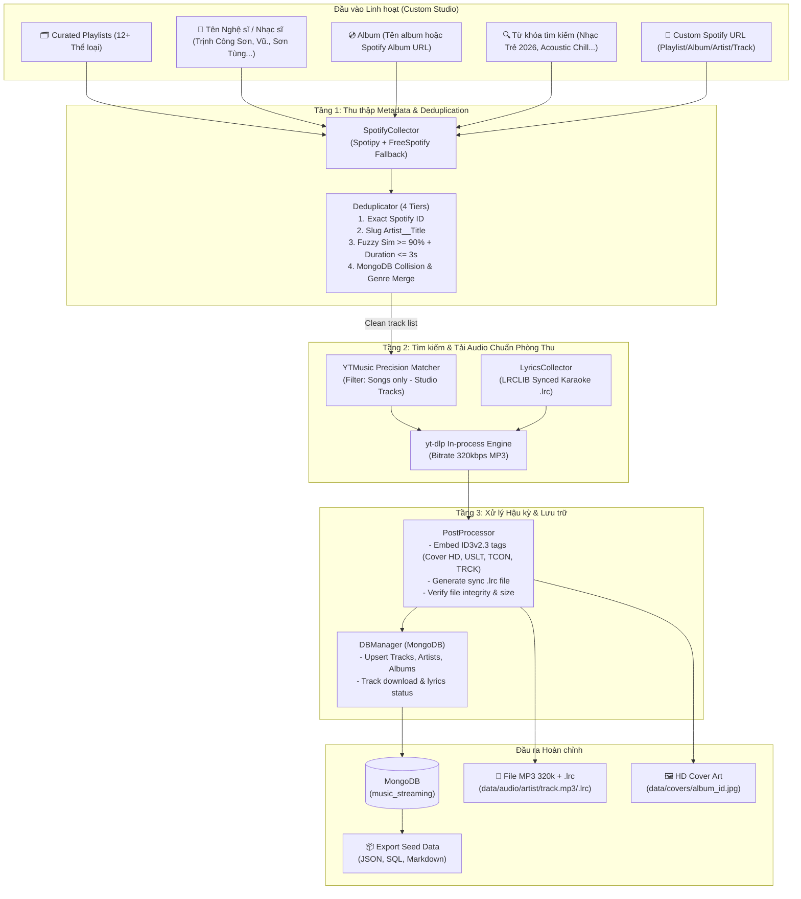
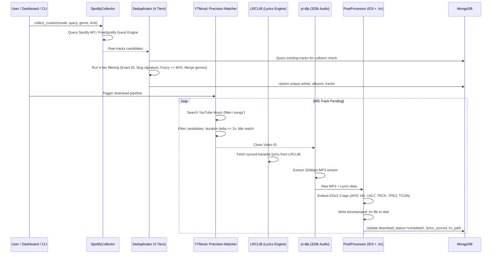

# 🎵 Music Data Collector — Thiết kế Hệ thống v3.5 (Streaming Master Pipeline)

> **Phiên bản:** 3.5 — Tích hợp Network Shield (Cloudflare WARP + Fingerprint Spoofing), Persistent Cookie Pool, Team RBAC & Active Bot-Check Resilience  
> **Ngày cập nhật:** 2026-08-17  
> **Mục đích:** Tài liệu thiết kế kiến trúc chuẩn phòng thu và đặc tả kỹ thuật cho hệ thống thu thập âm nhạc  
> **Dự án cha:** Xây dựng hệ thống nghe nhạc trực tuyến (ĐATN)  
> **Phạm vi:** Chỉ dùng nội bộ trong lớp/giáo viên — KHÔNG công khai

---

## MỤC LỤC

1. [Tổng quan & Bối cảnh](#1-tổng-quan--bối-cảnh)
2. [Chiến lược Thu thập Streaming Master](#2-chiến-lược-thu-thập-streaming-master)
3. [Công cụ & Module Cốt lõi](#3-công-cụ--module-cốt-lõi)
4. [Kiến trúc Hệ thống](#4-kiến-trúc-hệ-thống)
5. [Thiết kế Module Chi tiết](#5-thiết-kế-module-chi-tiết)
6. [Thiết kế Cơ sở Dữ liệu & Schema Lời bài hát](#6-thiết-kế-cơ-sở-dữ-liệu--schema-lời-bài-hát)
7. [Chiến lược Chống Rate-Limit & Ổn định](#7-chiến-lược-chống-rate-limit--ổn-định)
8. [Cấu trúc Dự án & Dependencies](#8-cấu-trúc-dự-án--dependencies)
9. [Quy trình Vận hành](#9-quy-trình-vận-hành)
10. [Tiêu chí Chất lượng & Ràng buộc Dữ liệu](#10-tiêu-chí-chất-lượng--ràng-buộc-dữ-liệu)
11. [Kế hoạch Kiểm thử (Test Suite)](#11-kế-hoạch-kiểm-thử-test-suite)
12. [Rủi ro & Giải pháp Dự phòng](#12-rủi-ro--giải-pháp-dự-phòng)
13. [Kiến Trúc Network Shield, Ẩn IP Datacenter & Phân Quyền Thành Viên](#13-kiến-trúc-network-shield-ẩn-ip-datacenter--phân-quyền-thành-viên)

---

## 1. Tổng quan & Bối cảnh

### 1.1 Vấn đề

- Dự án ĐATN cần **nhạc phổ biến, trending, âm thanh sạch chuẩn Studio 320kbps** và **lời bài hát đồng bộ thời gian thực (.lrc) cho tính năng Karaoke**.
- Nguồn dữ liệu Spotify có metadata cực tốt nhưng áp dụng chính sách chặn 403 đối với Developer Account Free trên một số endpoint.
- Giải pháp: Sử dụng kiến trúc **Streaming Master Pipeline** kết hợp:
  - **Spotify API + FreeSpotify Guest Engine:** Lấy metadata playlist, tracks, cover art HD không lo bị chặn 403.
  - **YTMusic Precision Matcher & In-process yt-dlp:** Lọc đúng bản thu âm phòng thu chính thức (Official Song Audio), tải siêu tốc (3-6s/bài) với bitrate cao nhất 320kbps.
  - **LRCLIB Ingestion:** Tự động lấy và sinh file lời đồng bộ Karaoke `.lrc` + nhúng thẻ `USLT`.
- Phạm vi: **chỉ phục vụ ĐATN**, giới hạn trong giáo viên + lớp, KHÔNG công khai.

### 1.2 Nguyên lý hoạt động cốt lõi

```
                              ▼
┌─────────────────────────────────────────────────────────────────────┐
│  TẦNG 3: Post-processing                                            │
│  ► Validate file MP3 (size, format, duration)                       │
│  ► Verify/Fix ID3 tags bằng Mutagen                                 │
│  ► Lưu metadata vào Database                                        │
│  ► Tổ chức file theo cấu trúc thư mục chuẩn                        │
│  ► Export seed data cho app chính                                    │
└─────────────────────────────────────────────────────────────────────┘
```

### 2.2 Nguồn Playlist Spotify đề xuất

Để có nhạc **trending, đa dạng genre**, crawl từ các playlist chính thức:

| Playlist | Spotify ID (ví dụ) | Mục đích |
|----------|-------------------|----------|
| **Today's Top Hits** | `37i9dQZF1DXcBWIGoYBM5M` | Top trending toàn cầu |
| **Global Top 50** | `37i9dQZEVXbMDoHDwVN2tF` | Top 50 phổ biến nhất |
| **Vietnam Top 50** | `37i9dQZEVXbLdGSmz6xilI` | Nhạc Việt phổ biến |
| **Top V-Pop** | (search trên Spotify) | Nhạc Việt theo genre |
| **RapCaviar** | `37i9dQZF1DX0XUsuxWHRQd` | Hip Hop/Rap |
| **Rock This** | `37i9dQZF1DXcF6B6QPhFDv` | Rock |
| **mint** | `37i9dQZF1DX4dyzvuaRJ0n` | Electronic/Dance |
| **Jazz Vibes** | `37i9dQZF1DX0SM0LYsmbMT` | Jazz |
| **Hot Country** | `37i9dQZF1DX1lVhptIYRda` | Country |
| **Chill Hits** | `37i9dQZF1DX4WYpdgoIcn6` | Chill/Ambient |
| **K-Pop ON!** | `37i9dQZF1DX9tPFwDMOaN1` | K-Pop |
| **Beast Mode** | `37i9dQZF1DX76Wlfdnj7AP` | Workout/Metal |
| **Peaceful Piano** | `37i9dQZF1DX4sWSpwq3LiO` | Classical/Instrumental |
| **Nhạc Trịnh** | (user tự tạo/tìm) | Nhạc Việt kinh điển |
| Albums yêu thích | (user tự chọn) | Bổ sung theo ý thích |

> **Lưu ý:** Spotify ID có thể thay đổi. User tự copy URL playlist từ Spotify app/web.

---

## 3. Công cụ Mã nguồn Mở Tích hợp

### 3.1 spotDL — Công cụ download chính

- **GitHub:** https://github.com/spotDL/spotify-downloader
- **Cài đặt:** `pip install spotdl`
- **Nguyên lý:** Nhận Spotify URL → lấy metadata → search YouTube → download + tag

**Cách gọi từ Python (subprocess):**
```python
import subprocess
# Download 1 track
subprocess.run(["python", "-m", "spotdl",
    "--user-auth",
    "--cookie-file", "cookies.txt",
    "--threads", "1",
    "--output", "./data/audio/{artist}/{title}.{output-ext}",
    "--format", "mp3",
    "--bitrate", "192k",
    "https://open.spotify.com/track/TRACK_ID"
])

# Save metadata only (không download audio)
subprocess.run(["python", "-m", "spotdl", "save",
    "--save-file", "playlist_data.spotdl",
    "https://open.spotify.com/playlist/PLAYLIST_ID"
])
```

**Flags quan trọng cho ổn định:**

| Flag | Mục đích | Bắt buộc? |
|------|----------|-----------|
| `--user-auth` | Dùng OAuth riêng, tránh shared credentials bị block | ✅ Bắt buộc |
| `--cookie-file cookies.txt` | Bypass YouTube anti-bot bằng cookies browser | ✅ Rất khuyến nghị |
| `--threads 1` | Single-thread, giảm burst → tránh rate limit | ✅ Bắt buộc cho bulk |
| `--format mp3` | Output format | ✅ |
| `--bitrate 192k` | Chất lượng phù hợp (YouTube thường max 128-256kbps) | Khuyến nghị |
| `--output {template}` | Đường dẫn output tùy chỉnh | ✅ |
| `--no-cache` | Clear cache nếu bị lỗi | Khi troubleshoot |

### 3.2 yt-dlp — Fallback download engine

- **GitHub:** https://github.com/yt-dlp/yt-dlp
- **Cài đặt:** `pip install yt-dlp`
- **Vai trò:** Backup khi spotDL fail cho 1 bài cụ thể

**Cách dùng làm fallback:**
```python
import yt_dlp

def download_from_youtube(search_query, output_path):
    """Search YouTube Music và download audio."""
    ydl_opts = {
        'format': 'bestaudio/best',
        'outtmpl': output_path,
        'postprocessors': [{
            'key': 'FFmpegExtractAudio',
            'preferredcodec': 'mp3',
            'preferredquality': '192',
        }],
        'quiet': True,
        'no_warnings': True,
        'cookiefile': 'cookies.txt',  # Bypass anti-bot
        'sleep_interval': 5,          # Delay giữa các download
        'max_sleep_interval': 15,
        'default_search': 'ytsearch', # Search YouTube
    }
    with yt_dlp.YoutubeDL(ydl_opts) as ydl:
        ydl.download([f"ytsearch:{search_query}"])
```

### 3.3 spotipy — Spotify metadata API

- **GitHub:** https://github.com/spotipy-dev/spotipy
- **Cài đặt:** `pip install spotipy`
- **Vai trò:** Thu thập metadata chất lượng cao từ Spotify

**Lưu ý cho 2026:**
- Cần **Spotify Premium** cho Developer Mode
- Audio features endpoint (`/audio-features`) đã **bị deprecated** cho app mới (từ 11/2024)
- Vẫn hoạt động tốt cho: track metadata, artist info, album info, playlist tracks, search
- Giới hạn 5 authorized users per app

### 3.4 Điều kiện tiên quyết (Prerequisites)

| Yêu cầu | Cách lấy |
|----------|----------|
| **Tài khoản Spotify Premium** | Đăng ký tại spotify.com (có trial) |
| **Spotify Developer App** | https://developer.spotify.com/dashboard → Create App |
| **Client ID + Secret** | Từ Spotify Developer Dashboard |
| **FFmpeg** | `spotdl --download-ffmpeg` hoặc cài riêng |
| **YouTube cookies** | Export từ browser bằng extension "Get cookies.txt LOCALLY" |
| **MongoDB** | Cài local hoặc dùng MongoDB Atlas (free tier) |

---

## 4. Kiến trúc Hệ thống (v3 Custom Studio & Deduplication Engine)

### 4.1 Sơ đồ Tổng quan



### 4.2 Luồng xử lý Chi tiết



    USER->>DM: download_pending()
    
    loop Mỗi track (status=pending), batch 50 bài
        DM->>DM: Delay 3-5 giây giữa mỗi bài
        DM->>DB: Update status → "downloading"
        
        alt spotDL thành công
            DM->>SDL: python -m spotdl <spotify_track_url>
            SDL-->>DM: ✅ MP3 file saved
        else spotDL fail
            DM->>YDL: yt-dlp ytsearch:"artist - title"
            YDL-->>DM: ✅ MP3 file saved
        else Cả 2 fail
            DM->>DB: Update status → "failed"
            DM->>DM: Log error, continue next track
        end

        DM->>PP: process(mp3_file, track_metadata)
        PP->>PP: Validate MP3 (size > 100KB, format OK)
        PP->>PP: Verify/Fix ID3 tags
        PP->>PP: Move file → data/audio/{artist}/{filename}.mp3
        PP->>DB: Update status → "completed", set local_path
    end

    USER->>DB: export_seed()
    DB-->>USER: JSON/SQL seed files
```

---

## 5. Thiết kế Module Chi tiết

### 5.1 `SpotifyCollector` — Thu thập Metadata

```
File: src/collectors/spotify_collector.py

Class: SpotifyCollector
├── __init__(client_id, client_secret)
│   └── Khởi tạo spotipy.Spotify với SpotifyClientCredentials
│
├── collect_playlist(playlist_url) → PlaylistData
│   ├── Gọi sp.playlist(playlist_id) → lấy info playlist
│   ├── Gọi sp.playlist_tracks(playlist_id) với pagination
│   │   └── Xử lý pagination: while results['next']: results = sp.next(results)
│   ├── Với mỗi track → extract metadata:
│   │   {
│   │     spotify_id, spotify_uri, name, duration_ms,
│   │     popularity, preview_url, explicit, disc_number, track_number,
│   │     artist_ids[], album_id, image_url, release_date
│   │   }
│   └── Return: list of normalized track dicts
│
├── collect_artist(artist_id) → ArtistData
│   └── sp.artist(artist_id) → extract:
│       { spotify_id, name, genres[], image_url, followers, popularity }
│
├── collect_album(album_id) → AlbumData
│   └── sp.album(album_id) → extract:
│       { spotify_id, name, artist_id, image_url, release_date, 
│         total_tracks, label, genres[] }
│
├── collect_multiple_playlists(playlist_urls) → FullDataset
│   └── Loop playlists → collect_playlist → dedup → collect unique artists/albums
│
├── search_track(query, limit=5) → list[TrackData]
│   └── sp.search(q=query, type='track', limit=limit)
│
└── get_spotify_url(track) → str
    └── "https://open.spotify.com/track/{spotify_id}"
```

**Xử lý Pagination cho Playlist lớn (>100 tracks):**
```python
def _get_all_playlist_tracks(self, playlist_id):
    results = self.sp.playlist_tracks(playlist_id)
    tracks = results['items']
    while results['next']:
        results = self.sp.next(results)
        tracks.extend(results['items'])
    return tracks
```

---

### 5.2 `DownloadManager` — Orchestrate Download

```
File: src/downloaders/download_manager.py

Class: DownloadManager
├── __init__(config)
│   ├── self.audio_dir = config.AUDIO_DIR
│   ├── self.spotdl_available = self._check_spotdl()
│   ├── self.cookies_path = config.COOKIES_PATH
│   └── self.delay = config.DOWNLOAD_DELAY  # 3-5 giây
│
├── download_track(track_data) → DownloadResult
│   ├── Tạo output path: data/audio/{artist_slug}/{track_id}_{title_slug}.mp3
│   ├── Thử spotDL trước (PRIMARY)
│   │   └── _download_via_spotdl(spotify_url, output_dir)
│   ├── Nếu fail → thử yt-dlp (FALLBACK)
│   │   └── _download_via_ytdlp(search_query, output_path)
│   ├── Validate file kết quả
│   └── Return: { success: bool, filepath: str, method: "spotdl"|"ytdlp", error: str }
│
├── download_batch(tracks, batch_size=50) → BatchResult
│   ├── Chia tracks thành batches (mỗi batch 50 bài)
│   ├── Giữa mỗi batch: nghỉ 60 giây (cool-down)
│   ├── Trong mỗi batch: delay 3-5 giây giữa mỗi bài
│   ├── Track progress với tqdm
│   ├── Log kết quả (success/fail/skip)
│   └── Return: { total, success, failed, skipped, results[] }
│
├── _download_via_spotdl(spotify_url, output_dir) → bool
│   ├── Build command:
│   │   ["python", "-m", "spotdl",
│   │    "--user-auth",
│   │    "--cookie-file", cookies_path,
│   │    "--threads", "1",
│   │    "--output", output_template,
│   │    "--format", "mp3",
│   │    "--bitrate", "192k",
│   │    spotify_url]
│   ├── Chạy subprocess.run(cmd, timeout=180, capture_output=True)
│   ├── Check return code
│   └── Return True nếu thành công
│
├── _download_via_ytdlp(search_query, output_path) → bool
│   ├── Dùng yt_dlp.YoutubeDL với opts:
│   │   format=bestaudio, codec=mp3, quality=192,
│   │   cookiefile, sleep_interval=5, default_search=ytsearch
│   ├── Download: ydl.download([f"ytsearch:{search_query}"])
│   └── Return True nếu file tồn tại
│
├── _build_search_query(track) → str
│   └── f"{track['artist_name']} - {track['name']}"
│
├── resume_failed() → BatchResult
│   └── Query DB: tracks where status="failed" → retry download
│
└── get_download_stats() → dict
    └── { pending, downloading, completed, failed }
```

**Batch execution flow:**
```
download_batch(1000 tracks):
  ├── Batch 1: tracks[0:50]   → download → cool-down 60s
  ├── Batch 2: tracks[50:100] → download → cool-down 60s
  ├── ...
  └── Batch 20: tracks[950:1000] → download → done
  
  Trong mỗi batch:
    ├── Track 1 → spotDL → OK → delay 3s
    ├── Track 2 → spotDL → FAIL → yt-dlp → OK → delay 5s
    ├── Track 3 → spotDL → OK → delay 3s
    └── ...
```

---

### 5.3 `PostProcessor` — Xử lý hậu kỳ

```
File: src/processors/post_processor.py

Class: PostProcessor
├── __init__(db_manager, file_manager)
│
├── process_downloaded_track(filepath, track_metadata) → ProcessResult
│   ├── [1] validate_audio_file(filepath) → check size, format, duration
│   ├── [2] verify_id3_tags(filepath) → đọc existing tags
│   ├── [3] fix_id3_tags(filepath, track_metadata) → ghi đè/bổ sung tags từ Spotify
│   │       Tags: TIT2(title), TPE1(artist), TALB(album), TDRC(year),
│   │             TCON(genre), TRCK(track#), APIC(cover art)
│   ├── [4] move_to_final_path(filepath) → data/audio/{artist}/{filename}.mp3
│   ├── [5] update_db(track_id, local_path, file_size, status="completed")
│   └── Return: { success, final_path, tags_fixed, errors }
│
├── validate_audio_file(filepath) → (bool, str)
│   ├── Check file exists
│   ├── Check size: 100KB < size < 50MB
│   ├── Check MP3 header (magic bytes: FF FB hoặc ID3)
│   ├── Try load bằng mutagen.mp3.MP3(filepath)
│   └── Check duration: 30s < duration < 3600s
│
├── fix_id3_tags(filepath, metadata) → bool
│   └── Dùng mutagen.mp3.MP3 + mutagen.id3:
│       - title = metadata['name']
│       - artist = metadata['artist_name']
│       - album = metadata['album_name']
│       - year = metadata['release_date'][:4]
│       - genre = metadata['genres'][0] if exists
│       - cover = download image từ metadata['image_url'] → embed APIC
│
├── process_batch(downloaded_files) → BatchProcessResult
│   └── Loop → process_downloaded_track → aggregate results
│
└── cleanup_invalid_files() → int
    └── Scan audio_dir, remove files < 100KB hoặc corrupt
```

---

### 5.4 `DataCleaner` — Chuẩn hóa dữ liệu

```
File: src/processors/data_cleaner.py

Class: DataCleaner
├── clean_track_metadata(raw) → dict
│   ├── Strip whitespace tất cả string fields
│   ├── Normalize Unicode (NFC)
│   ├── duration_ms → duration (seconds): raw['duration_ms'] // 1000
│   ├── Parse release_date → ISO format
│   ├── Sanitize name: remove [Official Video], (Lyrics), etc.
│   └── Lowercase & slugify genre tags
│
├── clean_artist_metadata(raw) → dict
│
├── clean_album_metadata(raw) → dict
│
├── sanitize_filename(name) → str
│   └── Remove: /\:*?"<>|, replace spaces→hyphens, max 50 chars
│
├── slugify(text) → str
│   └── lowercase, replace spaces/special→hyphens, strip diacritics
│
└── extract_genres_from_artist(artist_genres) → list[str]
    └── Spotify genres rất chi tiết ("vietnamese hip hop", "k-pop girl group")
        → Map về genre gốc ("hiphop", "kpop")
```

---

### 5.5 `Deduplicator` — Loại bỏ trùng lặp

```
File: src/processors/deduplicator.py

Class: Deduplicator
├── __init__(db_manager)
│
├── is_duplicate(track_data) → bool
│   ├── Level 1: Check spotify_id trong DB → exact match
│   ├── Level 2: Check (title_normalized + artist_normalized) → exact match
│   └── Return True nếu bất kỳ level nào match
│
├── dedup_track_list(tracks) → (unique_tracks, duplicates)
│   └── Remove duplicates trong cùng 1 batch (trước khi lưu DB)
│
└── _normalize(text) → str
    └── lowercase → remove punctuation → strip → collapse spaces
```

---

### 5.6 `GenreMapper` — Mapping genre thống nhất

```
File: src/processors/genre_mapper.py

Class: GenreMapper
├── map_genres(spotify_genres) → list[str]
│   └── Input: Spotify genres (chi tiết) → Output: genre chuẩn hóa cho app
│
├── get_primary_genre(genres) → str
│   └── Return genre đầu tiên (hoặc "other")
│
└── GENRE_MAP (built-in constant):

GENRE_MAP = {
    # Spotify genre keyword → Normalized slug
    "pop": "pop",
    "dance pop": "pop",
    "electropop": "pop",
    "synthpop": "pop",
    "v-pop": "vpop",
    "vietnamese pop": "vpop",
    
    "rock": "rock",
    "alt rock": "rock",
    "indie rock": "rock",
    "classic rock": "rock",
    "soft rock": "rock",
    
    "hip hop": "hiphop",
    "rap": "hiphop",
    "trap": "hiphop",
    "vietnamese hip hop": "hiphop",
    
    "electronic": "electronic",
    "edm": "electronic",
    "house": "electronic",
    "techno": "electronic",
    "trance": "electronic",
    
    "r&b": "rnb",
    "soul": "rnb",
    
    "jazz": "jazz",
    "smooth jazz": "jazz",
    
    "classical": "classical",
    "piano": "classical",
    "orchestral": "classical",
    
    "k-pop": "kpop",
    "k-pop boy group": "kpop",
    "k-pop girl group": "kpop",
    
    "metal": "metal",
    "heavy metal": "metal",
    "death metal": "metal",
    
    "country": "country",
    "folk": "folk",
    "acoustic": "folk",
    "blues": "blues",
    "reggae": "reggae",
    "latin": "latin",
    "reggaeton": "latin",
    "ambient": "ambient",
    "chill": "ambient",
    "indie": "indie",
}
# Nếu không match → assign "other"
```

---

### 5.7 `DBManager` — Quản lý Database

```
File: src/storage/db_manager.py

Class: DBManager
├── __init__(mongo_uri, db_name)
├── connect() / close()
│
│  # ── Artists ──
├── upsert_artist(data) → artist_id
│   └── Find by spotify_id → update if exists, insert if not
├── get_artist(spotify_id) → dict | None
├── get_all_artists() → list[dict]
│
│  # ── Albums ──
├── upsert_album(data) → album_id
├── get_album(spotify_id) → dict | None
│
│  # ── Tracks ──
├── upsert_track(data) → track_id
├── get_track(spotify_id) → dict | None
├── get_tracks_by_status(status) → list[dict]
│   └── status: "pending" | "downloading" | "completed" | "failed"
├── update_track_status(track_id, status, local_path=None, file_size=None)
├── get_tracks_by_genre(genre) → list[dict]
│
│  # ── Genres ──
├── upsert_genre(data) → genre_id
├── get_all_genres() → list[dict]
│
│  # ── Playlists ──
├── create_playlist(name, description, track_ids) → playlist_id
│
│  # ── Stats ──
├── get_stats() → { total_tracks, completed, failed, total_artists, total_albums... }
├── get_genre_distribution() → { "pop": 150, "rock": 120, ... }
│
│  # ── Bulk ──
├── bulk_upsert_tracks(tracks) → int (inserted count)
└── exists(collection, spotify_id) → bool
```

---

### 5.8 `FileManager` — Quản lý File

```
File: src/storage/file_manager.py

Class: FileManager
├── __init__(base_dir="./data")
├── ensure_dirs()  → Tạo: audio/, images/, raw/, exports/, logs/
│
├── get_audio_path(artist_name, track_id, track_name) → Path
│   └── data/audio/{slugify(artist)}/{track_id}_{slugify(title)}.mp3
│
├── get_image_path(entity_type, entity_id) → Path
│   └── data/images/{artists|albums}/{entity_id}.jpg
│
├── move_file(src, dest) → Path
├── file_exists(path) → bool
├── get_file_size(path) → int
├── get_storage_stats() → { total_files, total_size_mb, by_genre }
│
└── cleanup_empty_dirs()
```

---

### 5.9 `ExportManager` — Xuất Seed Data

```
File: src/storage/export_manager.py

Class: ExportManager
├── __init__(db_manager, export_dir)
│
├── export_json() → dict[str, Path]
│   └── Xuất 5 file: artists.json, albums.json, tracks.json, genres.json, playlists.json
│       Format: array of objects, UTF-8, pretty-printed
│
├── export_sql(dialect="postgresql") → Path
│   └── Tạo file .sql chứa CREATE TABLE + INSERT INTO cho tất cả tables
│       Hỗ trợ: postgresql, sqlserver
│
├── export_mongo_seed() → Path
│   └── Xuất .jsonl (1 JSON per line) cho mongoimport
│
├── generate_report() → ReportData
│   └── Thống kê:
│       - Tổng tracks/artists/albums/genres
│       - Genre distribution (bảng + chart data)
│       - Download success rate (%)
│       - Tổng dung lượng audio
│       - Danh sách tracks failed (để review)
│       - Top 10 artists by track count
│
└── generate_playlists() → int (number created)
    └── Tạo playlists tự động:
        - "Top {genre}" cho mỗi genre (top 20 by popularity)
        - "Most Popular" (top 50 overall by popularity)
        - "New Releases" (top 30 by release_date)
```

---

### 5.10 Utilities

```
File: src/utils/logger.py
  → get_logger(name) — Rich console + file logging

File: src/utils/rate_limiter.py
  → SimpleDelay(seconds) — Fixed delay giữa các requests
  → BatchDelay(batch_size, cool_down) — Delay giữa các batch

File: src/utils/retry_handler.py
  → @retry_on_failure(max_retries, backoff_base)
  → retry_download(func, max_retries)
```

---

## 6. Thiết kế Cơ sở Dữ liệu

### 6.1 MongoDB Schema

```javascript
// ──── Collection: artists ────
{
  _id: ObjectId,
  spotify_id: "6eUKZXaKkcviH0Ku9w2n3V",   // UNIQUE INDEX
  name: "Ed Sheeran",
  genres: ["pop", "uk pop", "singer-songwriter"],
  genres_normalized: ["pop"],                // Đã qua GenreMapper
  image_url: "https://i.scdn.co/image/...",
  local_image_path: "images/artists/6eUKZXaKkcviH0Ku9w2n3V.jpg",
  followers: 98000000,
  popularity: 92,
  track_count: 25,                           // Denormalized
  created_at: ISODate,
  updated_at: ISODate
}

// ──── Collection: albums ────
{
  _id: ObjectId,
  spotify_id: "3T4tUhGYeRNVUGevb0wThu",
  name: "÷ (Divide)",
  artist_id: ObjectId,                       // ref → artists._id
  artist_spotify_id: "6eUKZXaKkcviH0Ku9w2n3V",
  artist_name: "Ed Sheeran",                 // Denormalized
  image_url: "https://i.scdn.co/image/...",
  local_image_path: "images/albums/3T4tUhGYeRNVUGevb0wThu.jpg",
  release_date: "2017-03-03",
  total_tracks: 16,
  label: "Atlantic Records",
  created_at: ISODate,
  updated_at: ISODate
}

// ──── Collection: tracks ────
{
  _id: ObjectId,
  spotify_id: "0tgVpDi06FyKpA1z0VMD4v",    // UNIQUE INDEX
  spotify_uri: "spotify:track:0tgVpDi06FyKpA1z0VMD4v",
  name: "Perfect",
  artist_id: ObjectId,
  artist_spotify_id: "6eUKZXaKkcviH0Ku9w2n3V",
  artist_name: "Ed Sheeran",                 // Denormalized
  album_id: ObjectId,
  album_spotify_id: "3T4tUhGYeRNVUGevb0wThu",
  album_name: "÷ (Divide)",                  // Denormalized
  duration: 263,                              // Giây
  genres: ["pop"],                            // Normalized
  popularity: 88,                             // Spotify popularity score (0-100)
  explicit: false,
  track_number: 4,
  disc_number: 1,
  release_date: "2017-03-03",
  image_url: "https://i.scdn.co/image/...",
  
  // ── Download info ──
  spotify_url: "https://open.spotify.com/track/0tgVpDi06FyKpA1z0VMD4v",
  local_path: "audio/ed-sheeran/0tgVpDi06FyKpA1z0VMD4v_perfect.mp3",
  download_status: "completed",               // pending|downloading|completed|failed
  download_method: "spotdl",                   // spotdl|ytdlp
  download_error: null,                        // Error message nếu failed
  file_size_bytes: 6300000,
  
  // ── Source playlist ──
  source_playlists: ["37i9dQZF1DXcBWIGoYBM5M"],  // Spotify playlist IDs
  
  created_at: ISODate,
  updated_at: ISODate
}

// ──── Collection: genres ────
{
  _id: ObjectId,
  slug: "pop",                                // UNIQUE INDEX
  name: "Pop",
  description: "Popular music",
  track_count: 150
}

// ──── Collection: playlists ────
{
  _id: ObjectId,
  name: "Top Pop Hits",
  description: "Most popular pop songs in our collection",
  image_url: null,
  tracks: [
    { track_id: ObjectId, position: 1 },
    { track_id: ObjectId, position: 2 }
  ],
  total_tracks: 20,
  created_by: "system",
  source_spotify_id: "37i9dQZF1DXcBWIGoYBM5M",  // null nếu tạo tự động
  created_at: ISODate
}

// ──── INDEXES ────
// artists:   { spotify_id: 1 } UNIQUE, { name: 1 }
// albums:    { spotify_id: 1 } UNIQUE, { artist_id: 1 }
// tracks:    { spotify_id: 1 } UNIQUE, { artist_id: 1 }, { album_id: 1 },
//            { download_status: 1 }, { genres: 1 }, { popularity: -1 }
// genres:    { slug: 1 } UNIQUE
```

### 6.2 PostgreSQL Schema (Alternative)

```sql
CREATE TABLE artists (
    id              SERIAL PRIMARY KEY,
    spotify_id      VARCHAR(50) UNIQUE NOT NULL,
    name            VARCHAR(255) NOT NULL,
    genres_raw      TEXT,                -- JSON array as string
    genre_normalized VARCHAR(50),
    image_url       TEXT,
    followers       INT DEFAULT 0,
    popularity      INT DEFAULT 0,
    track_count     INT DEFAULT 0,
    created_at      TIMESTAMP DEFAULT NOW(),
    updated_at      TIMESTAMP DEFAULT NOW()
);

CREATE TABLE albums (
    id              SERIAL PRIMARY KEY,
    spotify_id      VARCHAR(50) UNIQUE NOT NULL,
    name            VARCHAR(255) NOT NULL,
    artist_id       INT NOT NULL REFERENCES artists(id),
    image_url       TEXT,
    release_date    DATE,
    total_tracks    INT DEFAULT 0,
    label           VARCHAR(255),
    created_at      TIMESTAMP DEFAULT NOW()
);

CREATE TABLE genres (
    id              SERIAL PRIMARY KEY,
    slug            VARCHAR(100) UNIQUE NOT NULL,
    name            VARCHAR(100) NOT NULL,
    description     TEXT,
    track_count     INT DEFAULT 0
);

CREATE TABLE tracks (
    id              SERIAL PRIMARY KEY,
    spotify_id      VARCHAR(50) UNIQUE NOT NULL,
    name            VARCHAR(500) NOT NULL,
    artist_id       INT NOT NULL REFERENCES artists(id),
    album_id        INT REFERENCES albums(id),
    duration        INT NOT NULL CHECK (duration >= 30),
    popularity      INT DEFAULT 0,
    explicit        BOOLEAN DEFAULT FALSE,
    track_number    INT,
    release_date    DATE,
    image_url       TEXT,
    spotify_url     VARCHAR(500) NOT NULL,
    local_path      VARCHAR(500),
    download_status VARCHAR(20) DEFAULT 'pending'
        CHECK (download_status IN ('pending','downloading','completed','failed')),
    download_method VARCHAR(10),
    download_error  TEXT,
    file_size_bytes BIGINT,
    created_at      TIMESTAMP DEFAULT NOW(),
    updated_at      TIMESTAMP DEFAULT NOW()
);

CREATE TABLE track_genres (
    track_id    INT NOT NULL REFERENCES tracks(id) ON DELETE CASCADE,
    genre_id    INT NOT NULL REFERENCES genres(id) ON DELETE CASCADE,
    PRIMARY KEY (track_id, genre_id)
);

CREATE TABLE playlists (
    id              SERIAL PRIMARY KEY,
    name            VARCHAR(255) NOT NULL,
    description     TEXT,
    source_spotify_id VARCHAR(50),
    total_tracks    INT DEFAULT 0,
    created_by      VARCHAR(100) DEFAULT 'system',
    created_at      TIMESTAMP DEFAULT NOW()
);

CREATE TABLE playlist_tracks (
    playlist_id INT NOT NULL REFERENCES playlists(id) ON DELETE CASCADE,
    track_id    INT NOT NULL REFERENCES tracks(id) ON DELETE CASCADE,
    position    INT NOT NULL,
    PRIMARY KEY (playlist_id, track_id)
);

-- Indexes
CREATE INDEX idx_tracks_artist ON tracks(artist_id);
CREATE INDEX idx_tracks_album ON tracks(album_id);
CREATE INDEX idx_tracks_status ON tracks(download_status);
CREATE INDEX idx_tracks_popularity ON tracks(popularity DESC);
```

---

## 7. Chiến lược Chống Rate-Limit & Ổn định

### 7.1 Config toàn bộ delays

```python
RATE_CONFIG = {
    # ── Spotify API ──
    "spotify_delay_between_requests": 0.3,     # 300ms giữa mỗi API call
    "spotify_batch_size": 50,                   # Max tracks per API call
    
    # ── spotDL ──
    "spotdl_threads": 1,                        # BẮT BUỘC single-thread
    "spotdl_delay_between_tracks": 5,           # 5 giây giữa mỗi track
    "spotdl_batch_size": 50,                    # 50 tracks rồi nghỉ
    "spotdl_batch_cooldown": 120,               # 2 phút nghỉ giữa batches
    "spotdl_timeout": 180,                      # 3 phút timeout per track
    
    # ── yt-dlp (fallback) ──
    "ytdlp_sleep_interval": 10,                 # 10 giây giữa mỗi download
    "ytdlp_max_sleep_interval": 20,
    
    # ── Download overall ──
    "daily_download_limit": 200,                # Max 200 bài/ngày (an toàn)
    "session_max_tracks": 100,                  # Max 100 bài/session
}
```

### 7.2 Chiến lược "Slow & Steady"

```
QUY TẮC VÀNG: Chậm mà ổn, không cần nhanh mà bị block

Timeline cho 1000 bài:
  Ngày 1: Crawl metadata tất cả playlists (chỉ Spotify API) → nhanh, 30 phút
  Ngày 2: Download batch 1: 200 bài → ~17 phút delay + download time ≈ 2-3 giờ
  Ngày 3: Download batch 2: 200 bài
  Ngày 4: Download batch 3: 200 bài
  Ngày 5: Download batch 4: 200 bài
  Ngày 6: Download batch 5: 200 bài + retry failed
  Ngày 7: Validate, fix, export

  → Tổng: ~7 ngày cho 1000 bài, RẤT an toàn
```

### 7.3 Retry & Error Handling

| Lỗi | Nguyên nhân | Xử lý |
|------|------------|-------|
| spotDL 429 | Spotify rate limit | Wait 60s → retry (max 2) |
| spotDL AudioProviderError | YouTube không tìm thấy | → Fallback yt-dlp |
| yt-dlp 403 | YouTube anti-bot | Check cookies → retry 1 lần |
| Timeout | Mạng chậm | Retry 2 lần, tăng timeout |
| File 0 bytes | Download bị ngắt | Delete file → retry |
| Wrong song | spotDL match sai | Log warning, giữ file, đánh dấu review |

### 7.4 Checklist Trước khi Chạy

```
□ Đã đăng nhập Spotify Premium trên browser
□ Đã tạo Spotify Developer App, có Client ID + Secret
□ Đã export cookies.txt từ YouTube (đăng nhập Google account)
□ Đã cài FFmpeg (spotdl --download-ffmpeg)
□ Đã chạy: spotdl --user-auth (lần đầu để authenticate)
□ Đã test thử download 1 bài thành công
□ MongoDB đang chạy
□ Đủ dung lượng ổ cứng (~5GB cho 1000 bài)
```

---

## 8. Cấu trúc Dự án & Dependencies

### 8.1 Directory Tree (v3 Architecture)

```
music-data-collector/
├── SYSTEM_DESIGN.md            ← Tài liệu Thiết kế Kiến trúc v3
├── README.md                   ← Hướng dẫn sử dụng & Khởi động nhanh
├── requirements.txt
├── config/
│   ├── .env.example
│   ├── .env                    ← Cấu hình API keys, MongoDB, Download Bitrate
│   ├── settings.py             ← Quản lý biến môi trường tập trung
│   ├── playlists.json          ← Danh mục 12+ playlist tuyển chọn
│   └── cookies.txt             ← (Tùy chọn) Cookie YouTube
├── src/
│   ├── collectors/
│   │   ├── spotify_collector.py    ← Spotify API + FreeSpotify Guest Engine (Custom Crawl)
│   │   └── lyrics_collector.py     ← Lấy Lời Karaoke .lrc & Plain Lyrics từ LRCLIB
│   ├── downloaders/
│   │   ├── ytmusic_matcher.py      ← Thuật toán so khớp Studio Audio YouTube Music
│   │   └── download_manager.py     ← Điều phối tải audio 320kbps MP3
│   ├── processors/
│   │   ├── post_processor.py       ← Nhúng ID3v2.3 tags (APIC HD, USLT) & sinh file .lrc
│   │   ├── data_cleaner.py         ← Chuẩn hóa Unicode NFC, lọc từ khóa thừa
│   │   ├── deduplicator.py         ← Thuật toán Chống trùng lặp 4 tầng & Gộp thể loại
│   │   └── genre_mapper.py         ← Chuẩn hóa thể loại Spotify sang 11 Slugs
│   ├── storage/
│   │   ├── db_manager.py           ← Quản lý CSDL MongoDB (music_streaming)
│   │   ├── file_manager.py         ← Quản lý file MP3, ảnh bìa, file .lrc
│   │   └── export_manager.py       ← Xuất dữ liệu JSON, SQL seed & Collection Report
│   └── utils/
│       ├── logger.py               ← Hệ thống ghi log đa cấp độ
│       ├── rate_limiter.py         ← Điều tiết tần suất gọi API
│       ├── health_checker.py       ← Giám sát tỷ lệ lỗi & Auto-cooldown
│       ├── session_manager.py      ← Checkpoint SQLite crash-safe
│       └── proxy_manager.py        ← Pool Proxy xoay vòng (Toggle)
├── dashboard/
│   ├── app.py                      ← Flask + Socket.IO Server điều khiển Dashboard
│   ├── templates/index.html        ← Giao diện Custom Crawl Studio & Real-time Telemetry
│   └── static/
│       ├── css/style.css           ← Glassmorphism Dark Mode CSS
│       └── js/main.js              ← WebSocket client & dynamic controls
├── scripts/
│   ├── crawl_metadata.py           ← Step 1: Cào metadata (Curated, Artist, Album, Search)
│   ├── download_audio.py           ← Step 2: Tải nhạc 320kbps + Lời Karaoke .lrc
│   ├── process_files.py            ← Step 3: Kiểm tra toàn vẹn & sửa tag ID3
│   ├── export_seed.py              ← Step 4: Xuất dữ liệu seed cho App chính
│   └── setup_check.py              ← Kiểm tra môi trường & công cụ
├── data/
│   ├── audio/                      ← Thư mục chứa file MP3 320k + file lời .lrc
│   ├── covers/                     ← Thư mục chứa ảnh bìa album HD
│   ├── raw/                        ← Dữ liệu JSON thô đã cào
│   └── exports/                    ← File seed JSON/SQL cho App Web
├── logs/
└── tests/
    └── test_pipeline.py            ← Bộ Unit Test tự động (15/15 tests)
```

---

### 8.3 CLI Scripts Interface

```bash
# Step 0: Kiểm tra môi trường & kết nối database
python scripts/setup_check.py

# Step 1: Cào Metadata với Custom Crawl Studio v3
# 1a. Cào theo 12 Playlist mặc định:
python scripts/crawl_metadata.py --mode curated --limit 50

# 1b. Cào theo tên Ca sĩ / Nhạc sĩ (Ví dụ: Trịnh Công Sơn, Sơn Tùng M-TP, Vũ.):
python scripts/crawl_metadata.py --mode artist --query "Trinh Cong Son" --genre vpop --limit 20

# 1c. Cào theo từ khóa tìm kiếm (Ví dụ: Nhạc Trẻ 2026, Acoustic Chill):
python scripts/crawl_metadata.py --mode search --query "Nhac Tre 2026" --genre vpop --limit 30

# 1d. Cào theo Spotify Playlist URL bất kỳ:
python scripts/crawl_metadata.py --mode playlist --query "https://open.spotify.com/playlist/..." --genre vpop --limit 50

# Step 2: Download Audio 320kbps + Lời Karaoke .lrc (Tốc độ ~4-6s/bài)
python scripts/download_audio.py --limit 50 --delay 2

# Step 2b: Tải lại các bài bị lỗi (Retry Failed)
python scripts/download_audio.py --retry-failed

# Step 3: Khởi chạy Real-time Web Dashboard (Custom Studio UI)
python dashboard/app.py
# → Mở trình duyệt http://127.0.0.1:5000

# Step 4: Xuất seed data cho ứng dụng Web App chính
python scripts/export_seed.py --format json --output data/exports/
python scripts/export_seed.py --format sql --dialect postgresql
```

---

## 9. Quy trình Vận hành

### Phase 0: Setup (1 lần duy nhất)
```
1. Cài Python 3.10+, pip
2. pip install -r requirements.txt
3. Chạy MongoDB local (mongodb://localhost:27017)
4. Copy .env.example → .env, điền cấu hình
5. python scripts/setup_check.py → Xác nhận 11/11 thành phần Ready
```

### Phase 1: Custom Metadata Crawling & Deduplication (~5-10 phút)
```
1. Sử dụng Web Dashboard (http://127.0.0.1:5000) hoặc CLI scripts/crawl_metadata.py.
2. Chọn nghệ sĩ / album / playlist / từ khóa yêu thích.
3. Thuật toán Deduplicator 4 tầng tự động:
   - Nhận diện bài trùng lặp (ID, Slug Signature, Fuzzy >= 90%).
   - Tự động gộp thể loại (Merge Genres) và bỏ qua bài đã có.
   - Lưu trữ metadata chuẩn vào MongoDB.
```

### Phase 2: High-Speed Studio Audio & Karaoke Ingestion (~45-50 phút cho 500 bài)
```
1. python scripts/download_audio.py --limit 500 --delay 2
2. YTMusic Precision Matcher tự động so khớp bản Studio sạch.
3. LRCLIB tự động lấy và xuất file lời đồng bộ .lrc (chuẩn Karaoke).
4. yt-dlp trích xuất MP3 320kbps và Mutagen gắn thẻ ID3v2.3 (APIC HD, USLT).
5. Checkpoint SQLite tự động lưu tiến trình từng bài (Crash-safe 100%).
```

### Phase 3: Export & Tích hợp vào Web App Nghe Nhạc
```
1. python scripts/export_seed.py --format json
2. Tích hợp thư mục data/audio/ (chứa MP3 + .lrc) và data/covers/ vào Backend App chính.
```

---

## 10. Tiêu chí Chất lượng & Ràng buộc Dữ liệu

### 10.1 Quality Rules

| # | Rule | Hành động khi vi phạm |
|---|------|----------------------|
| Q1 | Mỗi Track PHẢI có Artist tồn tại trong DB | Block insert |
| Q2 | name, duration, spotify_url PHẢI có giá trị | Skip track |
| Q3 | duration >= 30 giây | Skip track |
| Q4 | File MP3: 100KB < size < 50MB | Mark failed, retry |
| Q5 | File MP3 phải readable bởi mutagen | Mark failed, retry |
| Q6 | spotify_id UNIQUE | Skip duplicate |
| Q7 | (name + artist) không trùng | Skip, log warning |
| Q8 | status="completed" → local_path PHẢI có file thật | Mark failed |
| Q9 | Album.artist_id PHẢI reference Artist hợp lệ | Fix FK hoặc set null |
| Q10 | Tất cả text UTF-8, stripped | Auto-fix |

### 10.2 Consistency Constraints

```
PHẢI ĐẢM BẢO:
  ✓ Artist tồn tại TRƯỚC KHI tạo Album/Track
  ✓ Album.artist_id → artists._id (valid reference)
  ✓ Track.artist_id → artists._id (valid reference)  
  ✓ Track.album_id → albums._id (valid reference hoặc null)
  ✓ Track.genres[] → mỗi genre phải tồn tại trong genres collection
  ✓ Playlist.tracks[].track_id → tracks._id (all valid)
  ✓ Không orphan records
  ✓ download_status chỉ 4 giá trị: pending|downloading|completed|failed
  ✓ Khi completed → local_path NOT NULL + file tồn tại trên disk
```

---

## 11. Phân chia Nhiệm vụ cho Agent

### Task 1: Config & Utils (Làm đầu tiên)

**Files:** `config/settings.py`, `config/playlists.json`, `config/.env.example`, `src/utils/*`

**Mô tả:** Tạo hệ thống config load từ .env, logger (Rich + file), rate limiter (SimpleDelay + BatchDelay), retry handler (decorator)

**Test:** Logger ghi file đúng, delay hoạt động đúng thời gian, retry đúng số lần

---

### Task 2: Spotify Collector (Ưu tiên #1)

**File:** `src/collectors/spotify_collector.py`

**Mô tả:** Class dùng spotipy để crawl metadata từ Spotify playlists. Xử lý pagination, extract normalized data, collect unique artists/albums.

**Dependencies:** Task 1 (config, utils)

**Tham khảo:** Section 5.1 — class/method signatures chi tiết

**Test:** Mock spotipy responses, verify extraction logic, verify pagination handling

---

### Task 3: Download Manager (Ưu tiên #1)

**File:** `src/downloaders/download_manager.py`

**Mô tả:** Orchestrate download bằng spotDL (subprocess) và yt-dlp (fallback). Batch processing với delays. Track status trong DB.

**Dependencies:** Task 1, Task 5 (DBManager)

**Tham khảo:** Section 5.2 — class/method signatures + batch flow

**Yêu cầu đặc biệt:**
- spotDL gọi qua subprocess, KHÔNG import internal modules
- Luôn dùng `--user-auth --cookie-file --threads 1`
- Delay cấu hình được (mặc định 5s giữa tracks, 120s giữa batches)
- Khi spotDL fail 1 track → thử yt-dlp → nếu cả 2 fail → mark failed, continue next

---

### Task 4: Processors (Ưu tiên #2)

**Files:** `src/processors/post_processor.py`, `src/processors/data_cleaner.py`, `src/processors/deduplicator.py`, `src/processors/genre_mapper.py`

**Mô tả:** Validate MP3 files, fix ID3 tags, clean/normalize metadata, dedup, map genres.

**Dependencies:** Task 1

**Tham khảo:** Sections 5.3, 5.4, 5.5, 5.6

**Test:**
- Validator: test corrupt file, empty file, valid file
- Cleaner: test Unicode, date parsing, filename sanitization
- Dedup: test exact match, fuzzy match
- GenreMapper: test mapping table, unknown genre → "other"

---

### Task 5: Storage (Ưu tiên #2)

**Files:** `src/storage/db_manager.py`, `src/storage/file_manager.py`, `src/storage/export_manager.py`

**Dependencies:** Task 1

**Tham khảo:** Sections 5.7, 5.8, 5.9 + Section 6 (DB schema)

**Test:** CRUD operations, export JSON format, export SQL syntax

---

### Task 6: CLI Scripts (Làm cuối cùng)

**Files:** Tất cả files trong `scripts/`

**Dependencies:** Task 1-5

**Tham khảo:** Section 8.3 (CLI interface) + Section 9 (quy trình)

**Yêu cầu:** Dùng `click` library, có progress bar (`tqdm`/`rich`), có `--dry-run` option

---

### Task 7: Setup Check Script

**File:** `scripts/setup_check.py`

**Mô tả:** Script kiểm tra tất cả prerequisites trước khi chạy:
```
[✅] Python 3.10+
[✅] spotdl installed
[✅] yt-dlp installed  
[✅] FFmpeg available
[✅] Spotify credentials configured
[✅] cookies.txt exists
[✅] MongoDB connection OK
[✅] Data directories created
[❌] Spotify user auth — chạy: spotdl --user-auth
```

---

## 12. Rủi ro & Giải pháp Dự phòng

| Rủi ro | Xác suất | Tác động | Giải pháp |
|--------|----------|----------|-----------|
| spotDL bị block do Spotify siết API | Trung bình | Không download được | → Dùng yt-dlp fallback (search YouTube trực tiếp) |
| YouTube block IP do download nhiều | Thấp-TB | Download chậm/fail | → Dùng cookies, giảm tốc độ, đổi mạng |
| Spotify API thay đổi | Thấp | Metadata sai | → Cập nhật spotipy, check API docs |
| spotDL match sai bài | Trung bình | Dữ liệu sai | → Log warning, human review, hoặc dùng `--search-query` override |
| Không đủ 1000 bài | Thấp | Thiếu data | → Thêm playlists, dùng album URLs |
| Cookies hết hạn | Trung bình | Download fail | → Export lại cookies từ browser |
| Rate limit 24h | Trung bình | Phải chờ | → Tuân thủ "Slow & Steady", chạy qua nhiều ngày |

**Dự phòng cuối cùng:** Nếu cả spotDL + yt-dlp đều fail hàng loạt → quay về dùng **Jamendo API** (nhạc CC) để đảm bảo có data cho demo. Đây là safety net, KHÔNG phải primary strategy.

---

## 13. Kiến Trúc Network Shield, Ẩn IP Datacenter & Phân Quyền Thành Viên

### 13.1 Bối cảnh & Thách thức
Khi triển khai hệ thống trên hạ tầng đám mây (Oracle Cloud Infrastructure - OCI), toàn bộ lưu lượng mạng Egress mang dải IP Datacenter (`ASN 31898 - Oracle Corporation`). Các nền tảng streaming như YouTube, YouTube Music và Spotify áp dụng các cơ chế hạn chế nghiêm ngặt:
- **GVS PO-Token Challenge:** Yêu cầu Proof-of-Origin Token khi tải video từ IP Datacenter.
- **Bot Challenge ("Sign in to confirm you're not a bot"):** Hạn chế tần suất đối với các dải IP máy chủ.
- **Browser Fingerprint Mismatch:** Nhận diện các yêu cầu từ Python/Linux/curl thông qua User-Agent và Client Hints thiếu đồng bộ.

---

### 13.2 Mô hình Kiến trúc Network Shield Đa Tầng

```
┌─────────────────────────────────────────────────────────────────────────────────────────────┐
│                 MUSIC DATA COLLECTOR STUDIO - NETWORK & ANTI-DETECTION SHIELD               │
├─────────────────────────────────────────────────────────────────────────────────────────────┤
│                                                                                             │
│  [1. Browser Fingerprint Spoofing] ───> Giả lập User-Agent, Sec-CH-UA, TLS Header Trình Duyệt│
│                                                                                             │
│  [2. Egress Traffic Routing Hub]                                                            │
│       ├── 🌐 Mode A: Cloudflare WARP SOCKS5 Gateway (127.0.0.1:40000) [Miễn phí / Băng thông ∞]│
│       ├── 🛡️ Mode B: Rotating Residential Proxy Pool (Xoay vòng IP Dân cư)                    │
│       ├── 💻 Mode C: Custom Exit Node / Tailscale Tunnel (Định tuyến máy nhà)               │
│       └── ⚡ Mode D: Direct Connection (Fallback an toàn)                                    │
│                                                                                             │
│  [3. Active Cookie Health Probe] ────> Thẩm định trạng thái Cookie trước khi kích hoạt cảnh báo│
│                                                                                             │
│  [4. Live Egress IP Inspector] ─────> Giám sát thời gian thực: Host IP vs Egress IP          │
│                                       (Hiển thị huy hiệu 🟢 PROTECTED / 🟡 DIRECT trên Web)  │
│                                                                                             │
│  [5. Team RBAC & Persistent Storage]-> Quản lý người dùng, phân quyền (Admin, Collector,     │
│                                       Viewer), Leaderboard và Persistent Cookie Pool trong DB│
└─────────────────────────────────────────────────────────────────────────────────────────────┘
```

---

### 13.3 Chi tiết các Thành phần Kỹ thuật

#### A. Cloudflare WARP SOCKS5 Gateway Daemon
- **Module:** [`src/utils/warp_controller.py`](file:///d:/Hai/study/DATN/music-data-collector/src/utils/warp_controller.py) & [`scripts/install_warp.py`](file:///d:/Hai/study/DATN/music-data-collector/scripts/install_warp.py).
- **Cơ chế:** Khởi chạy `cloudflare-warp` ở chế độ SOCKS5 Proxy trên cổng `127.0.0.1:40000`. Toàn bộ luồng tải nhạc của yt-dlp được định tuyến qua mạng Anycast của Cloudflare (IP `104.28.x.x`, AS13335), ẩn hoàn toàn IP gốc `158.178.247.33` của Oracle.
- **Tương tác:** Công tắc Bật/Tắt 1-Click trên Web Dashboard (`POST /api/network/warp/toggle`).

#### B. Bộ Giả Lập Dấu Vân Tay & Hồ Sơ Trình Duyệt v4.0 (Browser Fingerprint Studio)
- **Module:** [`src/utils/fingerprint_generator.py`](file:///d:/Hai/study/DATN/music-data-collector/src/utils/fingerprint_generator.py).
- **Tham khảo công nghệ:** Lấy cảm hứng từ các thư viện hàng đầu thế giới: `browser-forge`, `curl_cffi`, `playwright-stealth`, `scrapling`, và `fingerprint-suite` (Apify).
- **Cơ chế mô phỏng tương quan 100% (Attribute Correlation Consistency):**
  - **8 Hồ sơ thiết bị đa nền tảng:** Windows 11 (Chrome 132 NVIDIA RTX 4070, Edge 131 AMD Radeon RX 7800, Firefox 134 Intel Iris Xe), macOS Sequoia (Safari 18.2 Apple M3 Max, Chrome 131 Apple M2 Pro), Mobile (iPhone 16 Pro Max iOS 18.1, Samsung Galaxy S24 Ultra Android 14), Smart TV (Samsung Cobalt / InnerTube on TV).
  - **Sec-CH-UA Client Hints:** Khớp chính xác `sec_ch_ua`, `sec_ch_ua_full_version_list`, `sec_ch_ua_platform`, `sec_ch_ua_platform_version`, `sec_ch_ua_arch`, `sec_ch_ua_bitness`, `sec_ch_ua_model`.
  - **WebGL GPU Context:** Giả lập trung thực `unmasked_vendor` và `unmasked_renderer` của phần cứng card đồ họa thực tế (NVIDIA, AMD, Apple Metal, Intel).
  - **Màn hình & DPI:** Kích thước `width`, `height`, `availWidth`, `availHeight`, `colorDepth` (24/30-bit), `devicePixelRatio` (1.0x, 1.25x, 2.0x, 3.0x, 3.75x).
  - **Phần cứng thiết bị:** `hardwareConcurrency` (4 - 16 Cores), `deviceMemory` (4 - 36 GB), `maxTouchPoints` (0 trên Desktop, 5 trên Mobile).
  - **Chữ ký TLS JA4 & InnerTube Player Context:** Khớp chữ ký TLS `t13d1516h2_8daaf6152771...` và đồng bộ client name (`WEB_REMIX`, `ANDROID_MUSIC`, `IOS_MUSIC`, `TVHTML5_SIMPLY_EMBEDDED_PLAYER`).
- **DOM Stealth Polyfill (`get_dom_stealth_script`):** Tự động xóa bỏ cờ `navigator.webdriver = undefined`, mock `window.chrome.runtime`, và polyfill tham số màn hình / WebGL.
- **REST APIs & Dashboard UI:** `/api/network/fingerprint/status`, `/api/network/fingerprint/switch`, `/api/network/fingerprint/test` với bảng điều khiển trực quan 6 thẻ thông số kỹ thuật và 1-Click Audit 7 điểm kiểm tra Anti-Detection.

#### C. Bộ Điều Phối Proxy Xoay Vòng Đa Chiến Lược (ProxyManager)
- **Module:** [`src/utils/proxy_manager.py`](file:///d:/Hai/study/DATN/music-data-collector/src/utils/proxy_manager.py).
- **4 Chiến lược luân chuyển:**
  1. `Round-Robin`: Xoay vòng tuần tự qua từng Proxy trong Pool.
  2. `Lowest-Latency`: Tự động ưu tiên Proxy có thời gian phản hồi thấp nhất (`ms`).
  3. `Failover-Only`: Ưu tiên Cloudflare WARP Gateway, chỉ chuyển sang Proxy dự phòng khi có lỗi.
  4. `Random`: Lựa chọn ngẫu nhiên mỗi bài tải.
- **Tự động cách ly (Auto-Quarantine):** Tự động chuyển trạng thái proxy sang `dead` nếu gặp 3 lỗi liên tiếp.
- **Live Egress Inspector:** Đo đạc IP thực tế, ISP và vị trí địa lý thông qua `inspect_proxy_egress()`.

#### D. Cơ Chế Chủ Động Thẩm Định Cookie & Xử Lý Lỗi Bot-Check
- **Module:** [`src/downloaders/download_manager.py`](file:///d:/Hai/study/DATN/music-data-collector/src/downloaders/download_manager.py) & [`src/utils/cookie_checker.py`](file:///d:/Hai/study/DATN/music-data-collector/src/utils/cookie_checker.py).
- **Khắc phục False-Alarm:** Khi gặp phản hồi `Sign in to confirm you're not a bot` trên một bài hát cụ thể (do bài hát bị gắn cờ thử nghiệm GVS PO-Token), hệ thống **không tự động dừng Pipeline**. Thay vào đó, hệ thống chạy active probe `CookieHealthChecker.check_health(probe_network=True)`:
  - Nếu Cookie **vẫn sống:** Ghi nhận cảnh báo cho riêng bài hát đó, tiếp tục tải bình thường các bài tiếp theo trong hàng đợi.
  - Nếu Cookie **thực sự hết hạn:** Kích hoạt cảnh báo và tạm dừng Pipeline để bảo vệ an toàn dữ liệu.

#### E. Hệ Thống Phân Quyền Thành Viên (Team RBAC) & Bảng Đóng Góp
- **Module:** [`src/storage/auth_manager.py`](file:///d:/Hai/study/DATN/music-data-collector/src/storage/auth_manager.py) & REST APIs (`/api/users`, `/api/team/leaderboard`).
- **3 Cấp độ quyền hạn:**
  - `Admin`: Toàn quyền quản trị tài khoản, cấu hình hệ thống, xóa bài hát, nạp proxy và cookie.
  - `Collector`: Cào dữ liệu, tải nhạc, nạp playlist, gắn nhãn.
  - `Viewer`: Xem báo cáo, nghe nhạc trên Data Catalog, xem logs.
- **Tính năng:** Bảng xếp hạng đóng góp (số bài đã cào, số bài đã tải), nhật ký hoạt động (Audit Logs), thêm/sửa/xóa/khóa tài khoản thành viên.

#### F. Kho Lưu Trữ Cookie Tập Trung Trên MongoDB (Cookie Pool)
- **Module:** `db.cookie_pool` & `/api/cookies`.
- **Cơ chế:** Lưu trữ danh sách cookies dạng Netscape vĩnh viễn trên cơ sở dữ liệu (không bị mất khi restart server), hỗ trợ:
  - Kiểm tra hạn sử dụng và độ trễ ping trực tiếp tới YouTube (`ms`).
  - Đánh dấu Cookie chính (`is_active`).
  - Gắn tag người nạp và chia sẻ cho các thành viên trong nhóm.

#### G. Giải Pháp Tự Dựng: Tailscale Mesh Exit Node (Self-Hosted Home Gateway)
- **Module:** [`src/utils/tailscale_controller.py`](file:///d:/Hai/study/DATN/music-data-collector/src/utils/tailscale_controller.py) & [`scripts/install_tailscale.py`](file:///d:/Hai/study/DATN/music-data-collector/scripts/install_tailscale.py).
- **Cơ chế:**
  - Định tuyến toàn bộ lưu lượng tải nhạc từ máy chủ Oracle Cloud qua máy tính cá nhân ở nhà (IP mạng dân cư VNPT/Viettel/FPT) thông qua đường hầm mã hóa WireGuard Mesh.
  - Khởi chạy Tailscale ở chế độ SOCKS5 Gateway trên cổng `127.0.0.1:1055` (`tailscale up --authkey=<key> --socks5-server=127.0.0.1:1055 --exit-node=<node>`).
  - Tự động nạp vào `db.proxies` và cho phép điều khiển, đổi Exit Node linh hoạt qua Web Dashboard (`/api/network/tailscale/*`).

#### H. Quản Lý Hồ Sơ Tùy Chỉnh, Tự Động Pre-flight Test & Watchdog Giám Sát Mất Kết Nối
- **Module:** [`src/storage/db_manager.py`](file:///d:/Hai/study/DATN/music-data-collector/src/storage/db_manager.py), [`src/utils/fingerprint_generator.py`](file:///d:/Hai/study/DATN/music-data-collector/src/utils/fingerprint_generator.py), [`src/downloaders/download_manager.py`](file:///d:/Hai/study/DATN/music-data-collector/src/downloaders/download_manager.py) & [`dashboard/app.py`](file:///d:/Hai/study/DATN/music-data-collector/dashboard/app.py).
- **Tính năng nổi bật:**
  1. **Thêm & Quản lý Hồ sơ Vân tay Tùy chỉnh (Custom Fingerprint Pool):**
     - Cho phép người dùng tự tạo hoặc import các hồ sơ trình duyệt / thiết bị riêng (Tên, OS, Browser, User-Agent, WebGL GPU, Màn hình, CPU/RAM, InnerTube Client).
     - Lưu trữ và đồng bộ hóa bền vững trên MongoDB (`db.fingerprint_profiles`), hỗ trợ gắn cờ `is_custom: True`, quản lý trạng thái `preflight_passed`, và cho phép xóa/sửa linh hoạt.
  2. **Cơ chế Kiểm Thử Tự Động Trước Khi Sử Dụng (Pre-flight Automated Testing):**
     - Khi người dùng thêm hồ sơ mới hoặc nhấn "Test & Kích Hoạt", hệ thống sẽ chạy active probe kiểm tra thực tế:
       - Tính hợp lệ của chuỗi User-Agent.
       - Tương quan nhất quán giữa Hệ điều hành và `Sec-CH-UA-Platform` Client Hints.
       - Hợp lệ của WebGL context & Độ phân giải màn hình.
       - Bắt tay TLS thực tế và đo lường độ trễ mạng chính xác (`ms`) qua endpoint Google/YouTube.
     - Chỉ kích hoạt hồ sơ khi đạt chuẩn 100% (`status = verified`). Nếu không đạt chuẩn sẽ cảnh báo và chặn để tránh gây lỗi chuỗi tải nhạc.
  3. **Watchdog Giám Sát Mất Kết Nối Thời Gian Thực (Network Health Watchdog):**
     - Endpoint `/api/network/health_watchdog` định kỳ quét toàn bộ trạng thái kết nối: Internet gốc máy chủ, Cổng Cloudflare WARP SOCKS5 (`127.0.0.1:40000`), Tailscale Mesh Tunnel (`127.0.0.1:1055`), Proxy Pool, và YouTube CDN API.
     - Khi phát hiện mất kết nối: Lập tức phát tín hiệu WebSocket `network_connection_lost`, hiển thị cảnh báo trực quan trên Dashboard và ghi nhật ký kiểm toán hệ thống.
  4. **Khả Năng Chống Chịu Lỗi & Tự Động Chuyển Vùng Pipeline (Fault-Tolerant Fallback):**
     - Khi `DownloadManager` gặp lỗi proxy chết, ngắt kết nối mạng hoặc bot challenge:
       - Tự động ghi nhận thất bại của proxy đó (`ProxyManager.report_failure`).
       - Tự động chuyển tiếp (failover) sang Proxy dự phòng hoặc cổng WARP Anycast.
       - Tự động xoay sang hồ sơ vân tay trình duyệt tiếp theo và tiếp tục quy trình mà không làm sập pipeline.

#### I. Cơ Chế Ràng Buộc Lỗi Toàn Diện, Chống Xung Đột & Triệt Tiêu Deadlock Đa Người Dùng (Lock & Concurrency Engine)
- **Module:** [`src/utils/lock_manager.py`](file:///d:/Hai/study/DATN/music-data-collector/src/utils/lock_manager.py), [`src/downloaders/download_manager.py`](file:///d:/Hai/study/DATN/music-data-collector/src/downloaders/download_manager.py), [`src/utils/warp_controller.py`](file:///d:/Hai/study/DATN/music-data-collector/src/utils/warp_controller.py), [`src/utils/tailscale_controller.py`](file:///d:/Hai/study/DATN/music-data-collector/src/utils/tailscale_controller.py), [`dashboard/app.py`](file:///d:/Hai/study/DATN/music-data-collector/dashboard/app.py).
- **Tính năng nổi bật:**
  1. **Khóa Tiến Trình Toàn Cục (Global Pipeline Execution Lock):**
     - Quản lý trạng thái khóa cào/tải dữ liệu qua MongoDB `db.system_locks` kết hợp Memory `RLock`.
     - Ngăn ngừa tình trạng 2 người dùng cùng lúc bấm chạy tác vụ gây tranh chấp tài nguyên (Race Condition), tự động trả về cảnh báo HTTP 409 và phát WebSocket `pipeline_lock_conflict` với tên người đang chạy và thời gian còn lại.
  2. **Khóa Nguyên Tử Từng Bài Hát (Per-Track Atomic Download Lock):**
     - Đảm bảo một bài hát (`spotify_id`) tại một thời điểm chỉ được tải bởi đúng 1 Worker Thread.
     - Sử dụng thư mục tạm cô lập theo UUID (`data/temp/{spotify_id}_{uuid}`) loại bỏ hoàn toàn lỗi tranh chấp file đĩa (`PermissionError` / File Collision) khi nhiều luồng cùng chạy.
  3. **Khóa Mutex Lệnh Phần Cứng & OS CLI (Hardware / CLI Execution Mutex):**
     - Tuần tự hóa các lệnh điều khiển mạng cấp thấp (`warp-cli connect/disconnect`, `tailscale up/set/down`) qua `execute_with_cli_mutex`, ngăn ngừa xung đột tiến trình hệ điều hành và tránh treo máy chủ.
  4. **Tự Động Thu Hồi Khóa Quá Hạn & Chống Deadlock (Self-Healing Stale Lock Reclamation):**
     - Mọi khóa đều có thời gian thuê (Lease TTL: 180s cho bài hát, 900s cho Pipeline).
     - Nếu máy chủ bị tắt đột ngột hoặc Worker bị crash, hệ thống sẽ tự động phát hiện và giải phóng các khóa quá hạn (*Stale Locks*), không bao giờ để xảy ra tình trạng Deadlock đóng băng hệ thống.
  5. **Giao Diện & API Quản Trị Khóa Hệ Thống:**
     - Endpoint `GET /api/system/locks` cho phép theo dõi thời gian thực các tác vụ đang chiếm giữ khóa.
     - Endpoint `POST /api/system/locks/force_unlock` hỗ trợ Quản trị viên can thiệp mở khóa cưỡng bức trong các tình huống khẩn cấp.

---

> **Ghi chú:** Tài liệu này đủ chi tiết để mỗi Task có thể được giao cho 1 agent độc lập triển khai. Mỗi agent chỉ cần đọc Task tương ứng + các Section reference để code mà không cần hỏi thêm.


